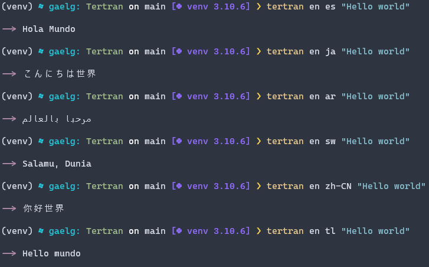
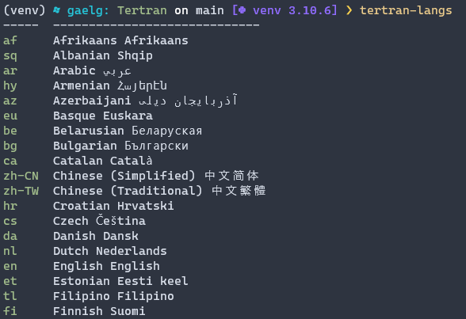

# Tertran (Terminal translator)

Tertran is a very bad name to my CLI built in python made to work in the terminal without the need for any browser.

## Requeriments

It needs python and pipp to work. It will also require external packages which can be installed with pip.

## Install

Download or use Git to clone this repository, once the directory is selected, use pip to install it on your machine

```cmd
pip install .
```

## Usage

Write tertran to use the translation function

```cmd
tertran <source lang> <target lang> <input>
```

Example:


Use tertram-langs to get a table with all language codes :D



## How it works?

It's simple, works by requesting a translation from the google translate API.

_Example:_

```py
  api_url = "https://translate.googleapis.com/translate_a/single?client=gtx&sl={}&tl={}&dt=t&q={}"

  r = requests.get(api_url.format(source_lang, target_lang, input_text))

```

Feel free to add new features if you want, but maybe my code is a bad base to work on, I'm inexperienced in this
